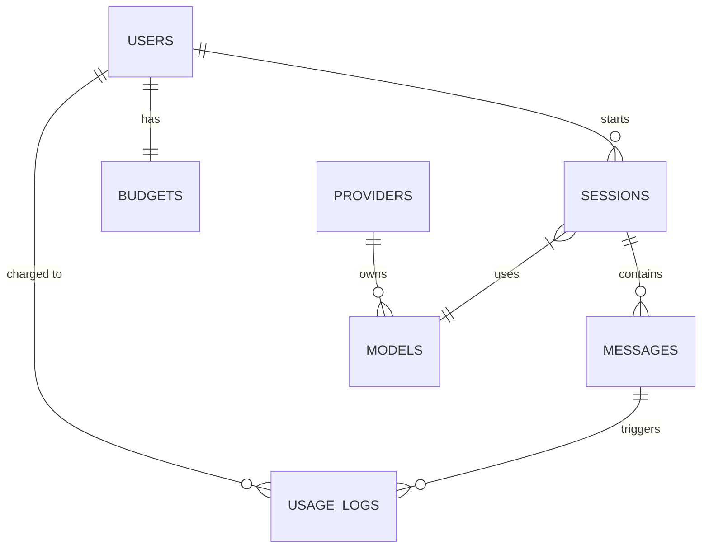

# 🏛️ GBot SaaS: Professional Database Schema Design

This design follows senior engineering best practices: **normalization**, **type safety** (UUIDs), **indexing** for performance, and **scalability** for multi-tenant SaaS.

---

## 1. Schema Overview

We will use the standard `public` schema. All tables include `created_at` and `updated_at` timestamps. Primary keys are `UUID` to prevent ID enumeration attacks and make migrations easier across different DB branches (like your Neon Setup).

### 📐 Table Relationship Diagram

---

## 2. Table Definitions

### Table: `users`
*The core identity table.*
- **`id`** (UUID, PK): Unique identifier.
- **`email`** (VARCHAR, Unique): Login credential.
- **`password_hash`** (TEXT): Securely hashed password.
- **`full_name`** (VARCHAR): User display name.
- **`metadata`** (JSONB): Flexible catch-all for preferences (e.g., `{"theme": "dark"}`).

### Table: `providers`
*Configuration for LLM sources (OpenAI, Vertex AI, Anthropic).*
- **`id`** (UUID, PK)
- **`name`** (VARCHAR): e.g., "Google Cloud", "OpenAI".
- **`config`** (JSONB): Store API keys (encrypted), Project IDs, Regions.
- **`is_active`** (BOOLEAN): Kill-switch for a provider.

### Table: `models`
*The available AI models.*
- **`id`** (UUID, PK)
- **`provider_id`** (UUID, FK -> providers.id)
- **`name`** (VARCHAR): e.g., "Claude 3.5 Sonnet", "Gemini 1.5 Pro".
- **`api_identifier`** (VARCHAR): The string sent to the API.
- **`input_price_per_1k`** (DECIMAL): For cost calculation.
- **`output_price_per_1k`** (DECIMAL): For cost calculation.

### Table: `sessions`
*The conversation thread.*
- **`id`** (UUID, PK)
- **`user_id`** (UUID, FK -> users.id, Indexed)
- **`title`** (VARCHAR): User-defined or AI-generated title.
- **`current_model_id`** (UUID, FK -> models.id): The model active for this thread.
- **`is_archived`** (BOOLEAN): soft-delete for UI.

### Table: `messages`
*Every line of the chat history.*
- **`id`** (UUID, PK)
- **`session_id`** (UUID, FK -> sessions.id, Indexed)
- **`role`** (VARCHAR): "user", "assistant", "system", or "**tool**".
- **`content`** (TEXT): The actual text.
- **`tool_calls`** (JSONB): If the assistant called GCP tools, store request here.
- **`tool_outputs`** (JSONB): Store the raw GCP API response here.

### Table: `user_budgets`
*Usage limits.*
- **`id`** (UUID, PK)
- **`user_id`** (UUID, FK -> users.id, Unique)
- **`credit_limit`** (DECIMAL): Max USD allowed.
- **`credits_used`** (DECIMAL)

### Table: `usage_logs`
*The audit trail for every single LLM call.*
- **`id`** (UUID, PK)
- **`user_id`** (UUID, FK)
- **`message_id`** (UUID, FK -> messages.id)
- **`prompt_tokens`** (INT)
- **`completion_tokens`** (INT)
- **`total_cost`** (DECIMAL)

---

## 3. Engineering Decisions (Why this works better)

1.  **Normalization vs. JSON Appending:** By keeping `messages` in their own table, we can fetch only the last 10 messages for context, significantly reducing your LLM token costs.
2.  **Separate `usage_logs` Table:** We never calculate "total cost" on the fly. We record every transaction. This is critical for high-load SaaS—it makes generating a monthly "Invoice" or "Usage Report" a simple SUM query instead of parsing thousands of chat logs.
3.  **Tool Role:** Including the `tool` role in messages allows us to reconstruct how the AI used GCP. This makes debugging much easier when a user asks "Why did you say my VM was off?"

---

## 4. Constraints & Indexes

- **FK Constraints:** `ON DELETE CASCADE` for `sessions` and `messages`. If a user deletes their account, their history is wiped automatically (GDPR compliance).
- **Index:** `idx_messages_session_id_created_at` — This makes your chat UI load almost instantly even if a user has 10,000 messages.
- **Index:** `idx_usage_user_id` — Essential for real-time budget checking.

### Next Step: SQL Implementation
Once you approve this, we will write the **SQL DDL** to create these tables in your **Neon Dev branch**. Ready?
