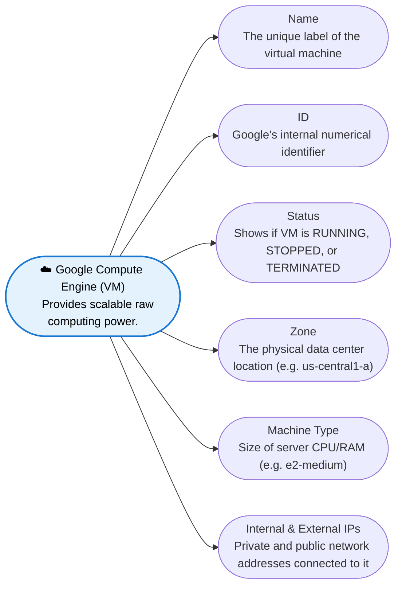
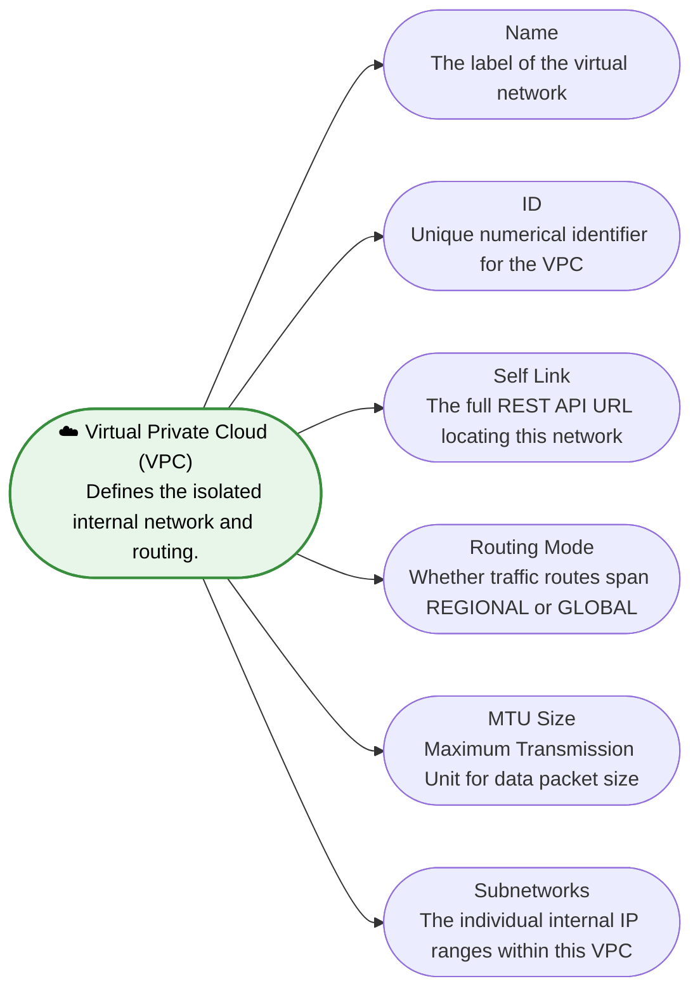
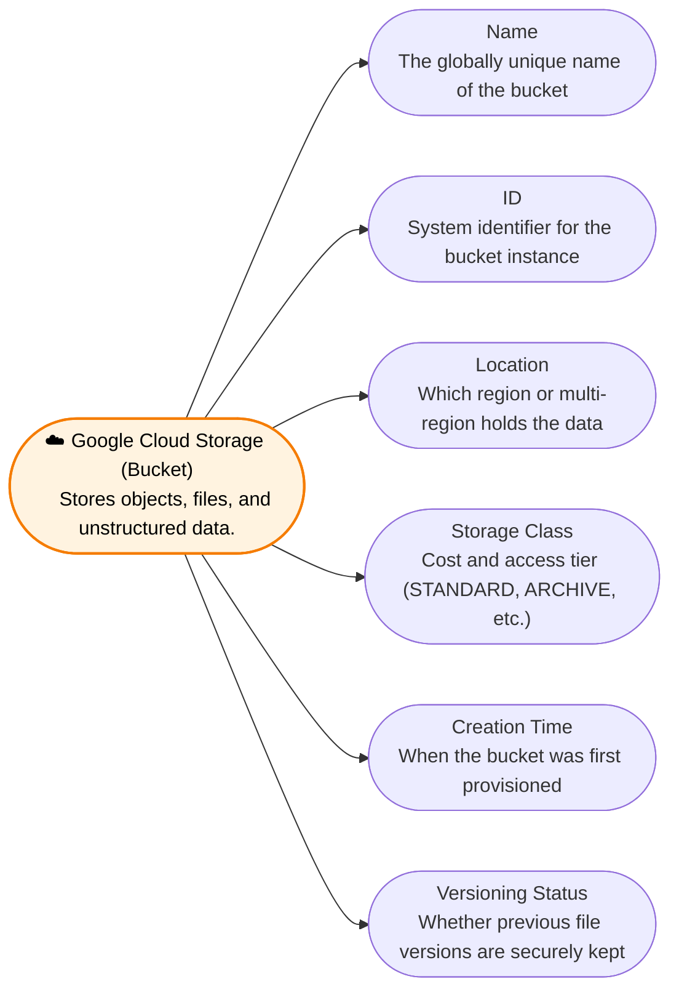
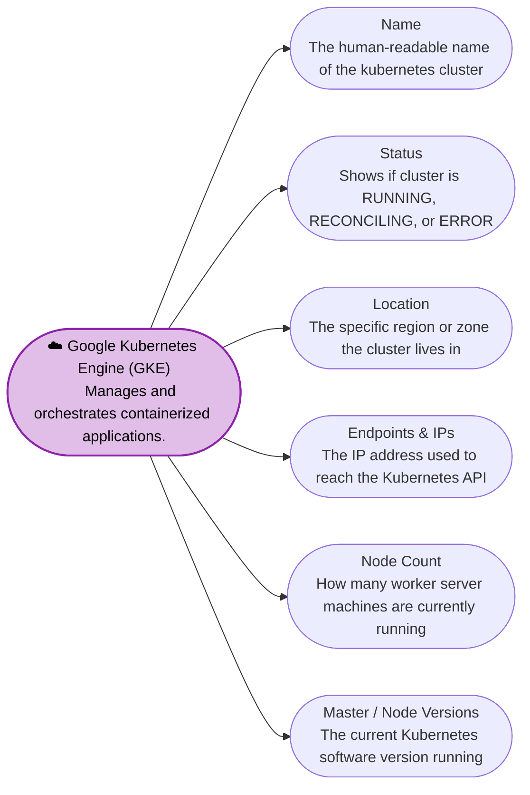
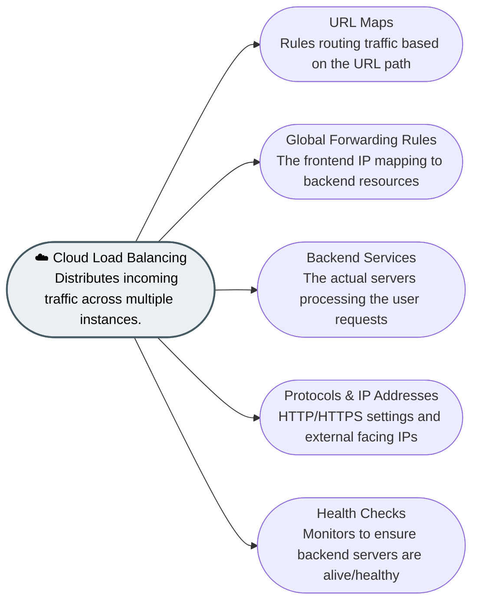
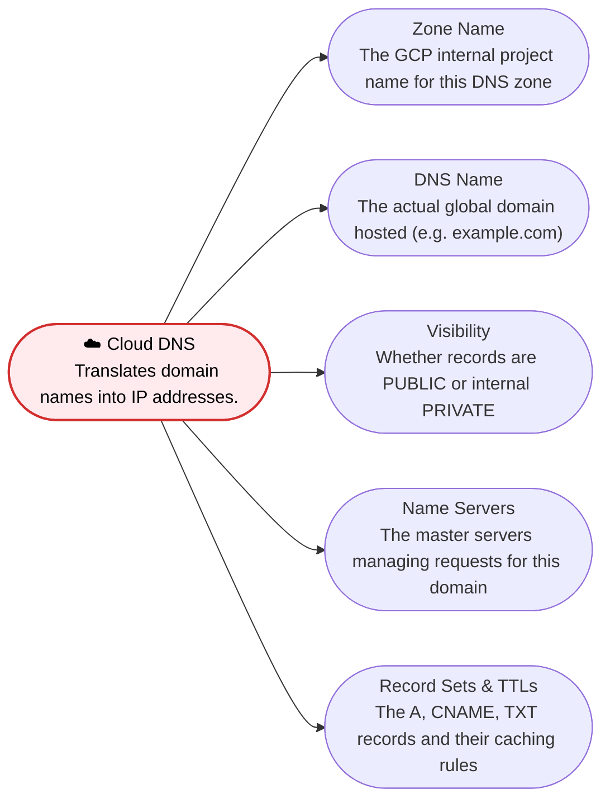
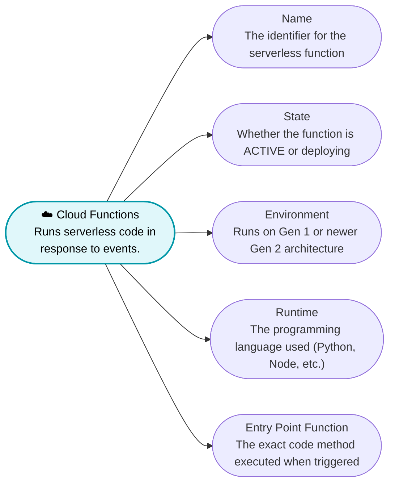
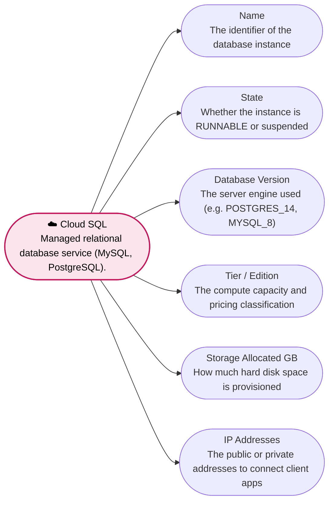
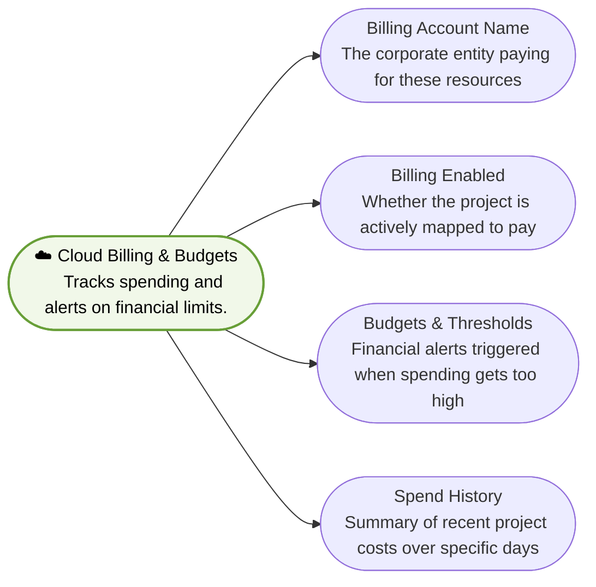

# GCP Service Extractions Visualized

```mermaid
graph LR
    %% Virtual Machine (VM) Diagram
    A(["☁️ Google Compute Engine (VM)
    Provides scalable raw computing power."])
    A --> B(["Name<br>The unique label of the virtual machine"])
    A --> C(["ID<br>Google's internal numerical identifier"])
    A --> D(["Status<br>Shows if VM is RUNNING, STOPPED, or TERMINATED"])
    A --> E(["Zone<br>The physical data center location (e.g. us-central1-a)"])
    A --> F(["Machine Type<br>Size of server CPU/RAM (e.g. e2-medium)"])
    A --> G(["Internal & External IPs<br>Private and public network addresses connected to it"])
    
    classDef cloud fill:#e3f2fd,stroke:#1976d2,stroke-width:2px,color:#000;
    class A cloud;
```

```mermaid
graph LR
    %% VPC Network Diagram
    A(["☁️ Virtual Private Cloud (VPC)
    Defines the isolated internal network and routing."])
    A --> B(["Name<br>The label of the virtual network"])
    A --> C(["ID<br>Unique numerical identifier for the VPC"])
    A --> D(["Self Link<br>The full REST API URL locating this network"])
    A --> E(["Routing Mode<br>Whether traffic routes span REGIONAL or GLOBAL"])
    A --> F(["MTU Size<br>Maximum Transmission Unit for data packet size"])
    A --> G(["Subnetworks<br>The individual internal IP ranges within this VPC"])
    
    classDef cloud fill:#e8f5e9,stroke:#388e3c,stroke-width:2px,color:#000;
    class A cloud;
```

```mermaid
graph LR
    %% Cloud Storage (GCS) Diagram
    A(["☁️ Google Cloud Storage (Bucket)
    Stores objects, files, and unstructured data."])
    A --> B(["Name<br>The globally unique name of the bucket"])
    A --> C(["ID<br>System identifier for the bucket instance"])
    A --> D(["Location<br>Which region or multi-region holds the data"])
    A --> E(["Storage Class<br>Cost and access tier (STANDARD, ARCHIVE, etc.)"])
    A --> F(["Creation Time<br>When the bucket was first provisioned"])
    A --> G(["Versioning Status<br>Whether previous file versions are securely kept"])
    
    classDef cloud fill:#fff3e0,stroke:#f57c00,stroke-width:2px,color:#000;
    class A cloud;
```

```mermaid
graph LR
    %% Google Kubernetes Engine (GKE) Diagram
    A(["☁️ Google Kubernetes Engine (GKE)
    Manages and orchestrates containerized applications."])
    A --> B(["Name<br>The human-readable name of the kubernetes cluster"])
    A --> C(["Status<br>Shows if cluster is RUNNING, RECONCILING, or ERROR"])
    A --> D(["Location<br>The specific region or zone the cluster lives in"])
    A --> E(["Endpoints & IPs<br>The IP address used to reach the Kubernetes API"])
    A --> F(["Node Count<br>How many worker server machines are currently running"])
    A --> G(["Master / Node Versions<br>The current Kubernetes software version running"])
    
    classDef cloud fill:#e1bee7,stroke:#8e24aa,stroke-width:2px,color:#000;
    class A cloud;
```

```mermaid
graph LR
    %% Load Balancer Diagram
    A(["☁️ Cloud Load Balancing
    Distributes incoming traffic across multiple instances."])
    A --> B(["URL Maps<br>Rules routing traffic based on the URL path"])
    A --> C(["Global Forwarding Rules<br>The frontend IP mapping to backend resources"])
    A --> D(["Backend Services<br>The actual servers processing the user requests"])
    A --> E(["Protocols & IP Addresses<br>HTTP/HTTPS settings and external facing IPs"])
    A --> F(["Health Checks<br>Monitors to ensure backend servers are alive/healthy"])
    
    classDef cloud fill:#eceff1,stroke:#455a64,stroke-width:2px,color:#000;
    class A cloud;
```

```mermaid
graph LR
    %% Cloud DNS Diagram
    A(["☁️ Cloud DNS
    Translates domain names into IP addresses."])
    A --> B(["Zone Name<br>The GCP internal project name for this DNS zone"])
    A --> C(["DNS Name<br>The actual global domain hosted (e.g. example.com)"])
    A --> D(["Visibility<br>Whether records are PUBLIC or internal PRIVATE"])
    A --> E(["Name Servers<br>The master servers managing requests for this domain"])
    A --> F(["Record Sets & TTLs<br>The A, CNAME, TXT records and their caching rules"])
    
    classDef cloud fill:#ffebee,stroke:#d32f2f,stroke-width:2px,color:#000;
    class A cloud;
```

```mermaid
graph LR
    %% Cloud Functions Diagram
    A(["☁️ Cloud Functions
    Runs serverless code in response to events."])
    A --> B(["Name<br>The identifier for the serverless function"])
    A --> C(["State<br>Whether the function is ACTIVE or deploying"])
    A --> D(["Environment<br>Runs on Gen 1 or newer Gen 2 architecture"])
    A --> E(["Runtime<br>The programming language used (Python, Node, etc.)"])
    A --> F(["Entry Point Function<br>The exact code method executed when triggered"])
    
    classDef cloud fill:#e0f7fa,stroke:#0097a7,stroke-width:2px,color:#000;
    class A cloud;
```

```mermaid
graph LR
    %% Cloud SQL Diagram
    A(["☁️ Cloud SQL
    Managed relational database service (MySQL, PostgreSQL)."])
    A --> B(["Name<br>The identifier of the database instance"])
    A --> C(["State<br>Whether the instance is RUNNABLE or suspended"])
    A --> D(["Database Version<br>The server engine used (e.g. POSTGRES_14, MYSQL_8)"])
    A --> E(["Tier / Edition<br>The compute capacity and pricing classification"])
    A --> F(["Storage Allocated GB<br>How much hard disk space is provisioned"])
    A --> G(["IP Addresses<br>The public or private addresses to connect client apps"])
    
    classDef cloud fill:#fce4ec,stroke:#c2185b,stroke-width:2px,color:#000;
    class A cloud;
```

```mermaid
graph LR
    %% Cloud Billing Diagram
    A(["☁️ Cloud Billing & Budgets
    Tracks spending and alerts on financial limits."])
    A --> B(["Billing Account Name<br>The corporate entity paying for these resources"])
    A --> C(["Billing Enabled<br>Whether the project is actively mapped to pay"])
    A --> D(["Budgets & Thresholds<br>Financial alerts triggered when spending gets too high"])
    A --> E(["Spend History<br>Summary of recent project costs over specific days"])
    
    classDef cloud fill:#f1f8e9,stroke:#689f38,stroke-width:2px,color:#000;
    class A cloud;
```
