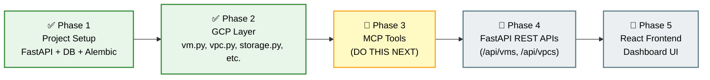
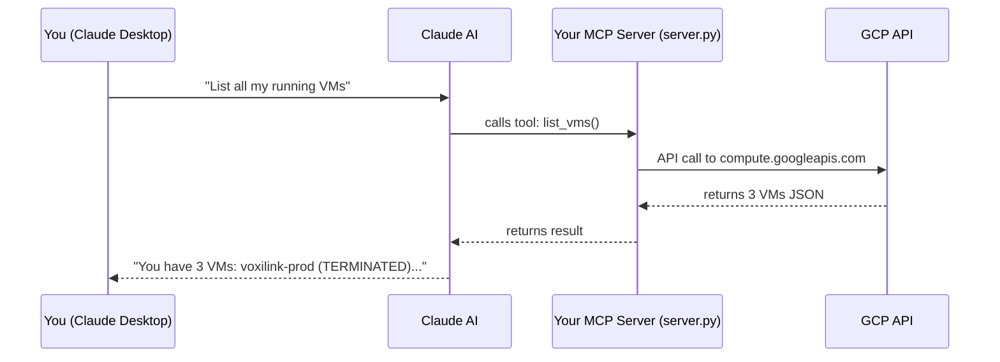

# Migration Roadmap: project_gbot → chatbot-mcp-service

## Where You Are Right Now



---

## ✅ Done (Phase 1 + 2)

| What | Status |
|---|---|
| FastAPI project structure | ✅ |
| SQLAlchemy + Alembic for DB | ✅ |
| `vm.py` — list + detail | ✅ |
| `vpc.py` — list + detail | ✅ |
| `storage.py`, `gke.py`, `dns.py`, `billing.py`, etc. | ✅ |
| Logger (per-service log files) | ✅ |
| Credentials via `GOOGLE_APPLICATION_CREDENTIALS` | ✅ |

---

## 🔲 Phase 3 — MCP Tools (DO THIS NEXT)

> [!IMPORTANT]
> MCP tools let you plug your GCP data directly into **Claude Desktop**. You ask Claude "list my VMs" and Claude calls your Python functions in real time.

### How MCP Works with Claude Desktop



### What to Build in `mcp/` folder

`mcp/tools.py` — Register each GCP function as an MCP tool:

```python
from mcp.server.fastmcp import FastMCP
from app.gcp.vm import list_vms, get_vm_details
from app.gcp.vpc import list_networks

mcp = FastMCP("GCP Assistant")

@mcp.tool()
def list_all_vms(project_id: str = None) -> list:
    """Lists all virtual machines across all zones."""
    return list_vms(project_id)

@mcp.tool()
def get_vm_info(vm_name: str) -> dict:
    """Gets details for a specific VM by name."""
    return get_vm_details(vm_name)
```

`mcp/server.py` — Start the MCP server:
```python
from app.mcp.tools import mcp

if __name__ == "__main__":
    mcp.run()
```

### Claude Desktop Config (after building)
Add this to `~/Library/Application Support/Claude/claude_desktop_config.json`:
```json
{
  "mcpServers": {
    "gcp-assistant": {
      "command": "python3",
      "args": ["-m", "app.mcp.server"],
      "cwd": "/path/to/chatbot-mcp-service/backend"
    }
  }
}
```

---

## 🔲 Phase 4 — FastAPI REST APIs

After MCP is working, expose the same GCP functions as HTTP endpoints:

```
GET  /api/gcp/vms              → list_vms()
GET  /api/gcp/vms/{name}       → get_vm_details()
GET  /api/gcp/vpcs             → list_networks()
GET  /api/gcp/storage          → list_buckets()
GET  /api/gcp/gke              → list_clusters()
GET  /api/gcp/billing          → get_billing_info()
```

---

## 🔲 Phase 5 — React Frontend

Dashboard that calls your Phase 4 APIs and shows:
- VM status cards (RUNNING / TERMINATED)
- VPC network map
- Storage bucket list
- Billing overview

---

> [!TIP]
> **Recommendation:** Build Phase 3 (MCP) first. It requires zero frontend work, gives you instant Claude Desktop integration to demo, and the tools you write are literally just wrappers around the `gcp/` code you already finished.
